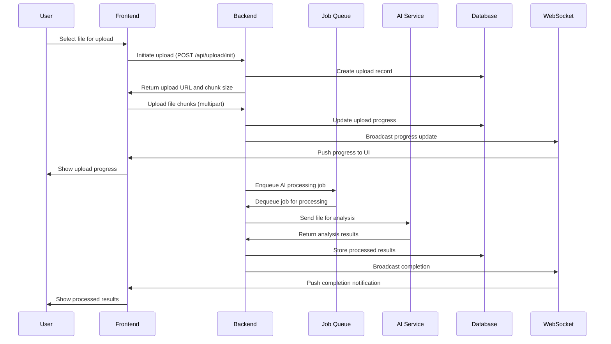
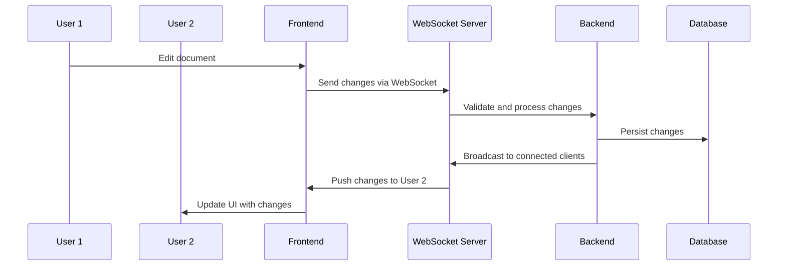
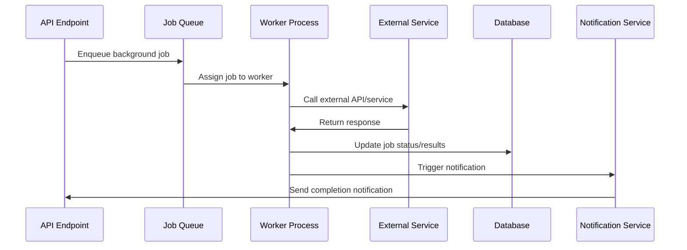

# System Architecture

## Overview

This document describes the multi-repo architecture strategy and system design for the CTOProjects platform. The architecture is designed to support scalable AI-powered file processing with real-time collaboration and background job processing.

## Multi-Repository Strategy

Our codebase is organized across three main repositories, each with distinct responsibilities:

### 1. Frontend Repository (`cto-frontend`)
**Responsibilities:**
- User interface and experience
- Client-side state management
- Real-time communication via WebSockets
- File upload handling and progress tracking
- Authentication and session management

**Technology Stack:**
- React/Next.js for the UI framework
- TypeScript for type safety
- Tailwind CSS for styling
- Socket.io-client for real-time communication
- Axios for HTTP communications

### 2. Backend Repository (`cto-backend`)
**Responsibilities:**
- REST API endpoints and business logic
- Authentication and authorization
- File processing orchestration
- Real-time WebSocket server
- Database operations and data persistence
- AI pipeline integration

**Technology Stack:**
- Node.js with Express/Fastify
- TypeScript
- PostgreSQL with Prisma ORM
- Redis for caching and job queues
- Socket.io for WebSocket connections
- Bull Queue for background job processing

### 3. Infrastructure Repository (`cto-infra`)
**Responsibilities:**
- Cloud infrastructure as code
- CI/CD pipeline definitions
- Docker configurations
- Kubernetes manifests
- Monitoring and logging setup
- Security configurations

**Technology Stack:**
- Terraform for infrastructure provisioning
- Docker for containerization
- Kubernetes for orchestration
- GitHub Actions for CI/CD
- Prometheus/Grafana for monitoring

## High-Level System Topology

```
┌─────────────────┐    ┌─────────────────┐    ┌─────────────────┐
│   Frontend      │    │    Backend      │    │  Infrastructure │
│   (Client)      │◄──►│   (API Server)  │◄──►│   (Cloud)       │
└─────────────────┘    └─────────────────┘    └─────────────────┘
         │                       │                       │
         │                       │                       │
    ┌────▼────┐            ┌─────▼─────┐            ┌─────▼─────┐
    │  CDN    │            │  Database │            │   Cloud   │
    │ (Static)│            │ PostgreSQL│            │  Services │
    └─────────┘            └───────────┘            └───────────┘
```

## Core Components and Interactions

### 1. Authentication Service
- **Location**: Backend Repository
- **Protocol**: OAuth 2.0 + JWT
- **Responsibilities**: User authentication, token management, session handling

### 2. File Upload Service
- **Location**: Backend Repository
- **Protocol**: HTTP multipart upload with chunking
- **Responsibilities**: File validation, temporary storage, upload progress tracking

### 3. AI Processing Pipeline
- **Location**: Backend Repository (orchestrator) + External AI Services
- **Protocol**: REST API calls to external AI providers
- **Responsibilities**: File analysis, AI model inference, result processing

### 4. Real-time Communication Layer
- **Location**: Backend Repository (WebSocket server) + Frontend (client)
- **Protocol**: WebSocket (Socket.io)
- **Responsibilities**: Live updates, progress tracking, collaboration features

### 5. Background Job Processing
- **Location**: Backend Repository
- **Protocol**: Redis-based message queues
- **Responsibilities**: Async file processing, email notifications, data cleanup

## Request and Data Flows

### File Upload through AI Pipeline Flow



### Real-time Collaboration Flow



### Background Processing Flow



## Technology Choices and Rationale

### Frontend Technology Stack
- **React/Next.js**: Component-based architecture with SSR capabilities for performance
- **TypeScript**: Static typing for better code quality and developer experience
- **Tailwind CSS**: Utility-first CSS framework for rapid UI development
- **Socket.io-client**: Reliable WebSocket implementation with fallbacks

### Backend Technology Stack
- **Node.js**: JavaScript runtime for consistent full-stack development
- **Express/Fastify**: Lightweight, performant web frameworks
- **PostgreSQL**: ACID-compliant relational database with strong consistency
- **Redis**: High-performance in-memory data store for caching and queues
- **Prisma**: Type-safe database access with automatic migrations

### Infrastructure and DevOps
- **Terraform**: Infrastructure as Code for reproducible deployments
- **Docker**: Containerization for consistent environments
- **Kubernetes**: Container orchestration for scalability and resilience
- **GitHub Actions**: CI/CD pipeline automation

## External Integrations

### AI Service Providers
- **OpenAI API**: GPT models for text analysis and generation
- **Anthropic Claude**: Advanced reasoning and analysis capabilities
- **Google Cloud Vision**: Image and document analysis
- **AWS Textract**: OCR and document processing

### Communication Services
- **SendGrid**: Email delivery and templating
- **Twilio**: SMS and voice communications
- **Pusher/WebSockets**: Real-time messaging infrastructure

### Storage and CDN
- **AWS S3**: Scalable object storage for files
- **CloudFront CDN**: Global content delivery network
- **Redis Cloud**: Managed Redis service for caching

## Service Interfaces and APIs

### Internal API Contracts

#### File Management API
```
POST   /api/files/upload          - Upload new file
GET    /api/files/:id              - Retrieve file metadata
PUT    /api/files/:id              - Update file properties
DELETE /api/files/:id              - Delete file
GET    /api/files/:id/download     - Download file
```

#### AI Processing API
```
POST   /api/ai/analyze             - Submit file for AI analysis
GET    /api/ai/status/:jobId       - Check processing status
GET    /api/ai/results/:jobId      - Retrieve analysis results
POST   /api/ai/batch               - Batch processing requests
```

#### Real-time Events
```
upload:progress                    - File upload progress
upload:complete                    - Upload completion
ai:processing_started             - AI processing started
ai:processing_progress            - AI processing progress
ai:processing_complete            - AI processing complete
collaboration:change              - Document changes
notification:new                  - New notifications
```

### External API Integrations

#### AI Provider Interfaces
- Standardized request/response format for AI providers
- Fallback mechanisms for service unavailability
- Rate limiting and retry logic
- Cost tracking and quota management

## Scaling Considerations

### Horizontal Scaling Strategy
- **Stateless API servers**: Multiple instances behind load balancer
- **Database read replicas**: Read-heavy workloads distributed across replicas
- **Redis cluster**: Distributed caching and job queuing
- **CDN edge locations**: Global content delivery

### Performance Optimization
- **Database indexing**: Optimized queries for common access patterns
- **Caching layers**: Multi-level caching (browser, CDN, application, database)
- **Async processing**: Non-blocking operations for long-running tasks
- **Connection pooling**: Efficient database and external service connections

### Fault Tolerance and Resilience
- **Circuit breakers**: Prevent cascade failures from external services
- **Retry mechanisms**: Exponential backoff for transient failures
- **Health checks**: Automated monitoring and self-healing
- **Graceful degradation**: Fallback functionality during service degradation

## Security Architecture

### Authentication and Authorization
- **JWT tokens**: Stateless authentication with refresh tokens
- **OAuth 2.0**: Third-party identity provider integration
- **Role-based access control**: Granular permission management
- **API rate limiting**: Prevent abuse and ensure fair usage

### Data Protection
- **Encryption at rest**: Database and file storage encryption
- **Encryption in transit**: TLS 1.3 for all communications
- **PII handling**: Sensitive data identification and protection
- **Audit logging**: Comprehensive activity tracking

### Infrastructure Security
- **Network segmentation**: Isolated environments for different services
- **Secrets management**: Encrypted storage for credentials and keys
- **VPC configuration**: Private network with controlled access
- **Security scanning**: Automated vulnerability detection

## Monitoring and Observability

### Metrics and Logging
- **Application metrics**: Performance, error rates, usage patterns
- **Infrastructure metrics**: CPU, memory, network, storage utilization
- **Business metrics**: User engagement, conversion rates, feature adoption
- **Structured logging**: Consistent log format for analysis

### Alerting and Incident Response
- **Multi-level alerts**: Warning, critical, and emergency thresholds
- **Automated responses**: Predefined actions for common incidents
- **Escalation policies**: Tiered notification and response procedures
- **Post-incident analysis**: Root cause analysis and improvement tracking

## Development and Deployment Workflow

### CI/CD Pipeline
1. **Code commit** triggers automated builds
2. **Automated testing** runs unit, integration, and E2E tests
3. **Security scanning** checks for vulnerabilities
4. **Docker image** creation and tagging
5. **Staging deployment** for validation
6. **Production deployment** with rollback capability

### Environment Strategy
- **Development**: Local development with hot reloading
- **Staging**: Production-like environment for testing
- **Production**: Highly available, monitored environment
- **Feature flags**: Gradual feature rollouts and A/B testing

## Future Considerations

### Microservices Evolution
- **Service decomposition**: Gradual split from monolith to microservices
- **Service mesh**: Inter-service communication and security
- **API gateway**: Centralized request routing and management
- **Event-driven architecture**: Asynchronous communication patterns

### Advanced AI Capabilities
- **Model fine-tuning**: Custom AI models for specific use cases
- **Edge AI**: Local processing for privacy and latency
- **Multi-modal AI**: Combined text, image, and audio processing
- **AI pipeline optimization**: Intelligent routing and load balancing

### Global Expansion
- **Multi-region deployment**: Geographic distribution for low latency
- **Data sovereignty**: Compliance with regional data regulations
- **Localization**: Multi-language support and cultural adaptation
- **Global CDN**: Optimized content delivery worldwide

---

## Conclusion

This architecture provides a solid foundation for building a scalable, maintainable, and secure AI-powered platform. The multi-repo strategy ensures clear separation of concerns while maintaining efficient development workflows. The design prioritizes user experience, system reliability, and future growth potential.

Regular architecture reviews and updates will ensure the system evolves with changing requirements and technological advancements.