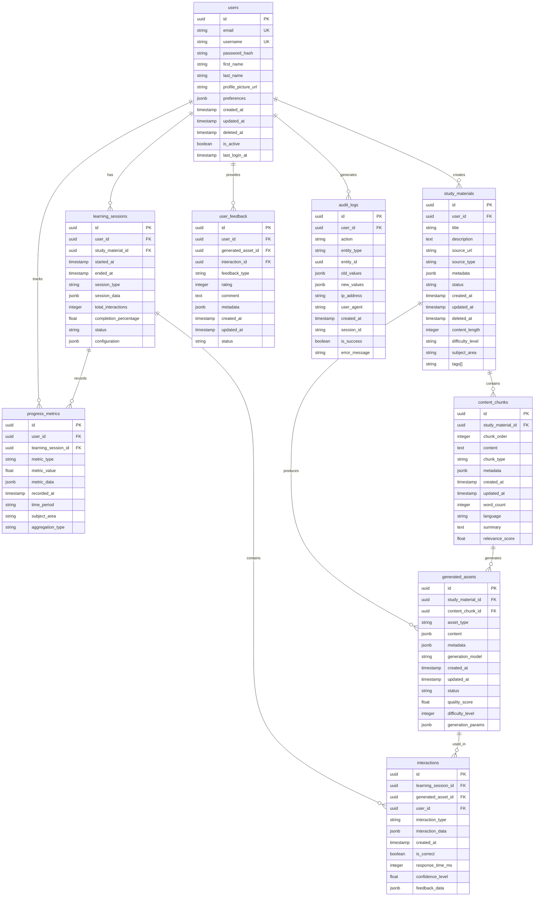

# Database Schema

## Overview

This document defines the complete database schema for the learning platform, including entity relationships, table definitions, indexing strategies, and migration guidelines.

## Entity Relationship Diagram (ERD)



## Table Definitions

### users

**Description**: Core user accounts and authentication information

| Column | Type | Constraints | Description |
|--------|------|-------------|-------------|
| id | uuid | PRIMARY KEY | Unique user identifier |
| email | varchar(255) | UNIQUE NOT NULL | User email address |
| username | varchar(50) | UNIQUE NOT NULL | Unique username |
| password_hash | varchar(255) | NOT NULL | Bcrypt hashed password |
| first_name | varchar(100) | | User's first name |
| last_name | varchar(100) | | User's last name |
| profile_picture_url | varchar(500) | | URL to profile image |
| preferences | jsonb | | User preferences and settings |
| created_at | timestamp | NOT NULL DEFAULT NOW() | Account creation timestamp |
| updated_at | timestamp | NOT NULL DEFAULT NOW() | Last update timestamp |
| deleted_at | timestamp | | Soft delete timestamp |
| is_active | boolean | NOT NULL DEFAULT true | Account status |
| last_login_at | timestamp | | Last successful login |

**Indexes**:
- `idx_users_email` (email)
- `idx_users_username` (username)
- `idx_users_created_at` (created_at)
- `idx_users_is_active_deleted_at` (is_active, deleted_at)

---

### study_materials

**Description**: Learning materials uploaded or created by users

| Column | Type | Constraints | Description |
|--------|------|-------------|-------------|
| id | uuid | PRIMARY KEY | Unique material identifier |
| user_id | uuid | NOT NULL REFERENCES users(id) | Owner user ID |
| title | varchar(255) | NOT NULL | Material title |
| description | text | | Detailed description |
| source_url | varchar(1000) | | Original source URL |
| source_type | varchar(50) | NOT NULL | Type of source (upload, url, text) |
| metadata | jsonb | | Additional metadata |
| status | varchar(20) | NOT NULL DEFAULT 'processing' | Processing status |
| created_at | timestamp | NOT NULL DEFAULT NOW() | Creation timestamp |
| updated_at | timestamp | NOT NULL DEFAULT NOW() | Last update timestamp |
| deleted_at | timestamp | | Soft delete timestamp |
| content_length | integer | | Length in characters/words |
| difficulty_level | varchar(20) | | Difficulty rating |
| subject_area | varchar(100) | | Academic subject |
| tags | text[] | | Searchable tags |

**Indexes**:
- `idx_study_materials_user_id` (user_id)
- `idx_study_materials_status` (status)
- `idx_study_materials_created_at` (created_at)
- `idx_study_materials_subject_area` (subject_area)
- `idx_study_materials_tags` (tags) GIN
- `idx_study_materials_deleted_at` (deleted_at)

---

### content_chunks

**Description**: Processed segments of study materials for targeted learning

| Column | Type | Constraints | Description |
|--------|------|-------------|-------------|
| id | uuid | PRIMARY KEY | Unique chunk identifier |
| study_material_id | uuid | NOT NULL REFERENCES study_materials(id) | Parent material ID |
| chunk_order | integer | NOT NULL | Sequential order within material |
| content | text | NOT NULL | Chunk content |
| chunk_type | varchar(50) | NOT NULL | Type of content (paragraph, section, etc.) |
| metadata | jsonb | | Additional chunk metadata |
| created_at | timestamp | NOT NULL DEFAULT NOW() | Creation timestamp |
| updated_at | timestamp | NOT NULL DEFAULT NOW() | Last update timestamp |
| word_count | integer | | Number of words in chunk |
| language | varchar(10) | | Language code |
| summary | text | | Auto-generated summary |
| relevance_score | float | | ML relevance score (0-1) |

**Indexes**:
- `idx_content_chunks_study_material_id` (study_material_id)
- `idx_content_chunks_chunk_order` (study_material_id, chunk_order)
- `idx_content_chunks_chunk_type` (chunk_type)
- `idx_content_chunks_relevance_score` (relevance_score)
- `idx_content_chunks_language` (language)

---

### generated_assets

**Description**: AI-generated learning assets from content chunks

| Column | Type | Constraints | Description |
|--------|------|-------------|-------------|
| id | uuid | PRIMARY KEY | Unique asset identifier |
| study_material_id | uuid | NOT NULL REFERENCES study_materials(id) | Source material ID |
| content_chunk_id | uuid | REFERENCES content_chunks(id) | Source chunk ID |
| asset_type | varchar(50) | NOT NULL | Type (quiz, flashcard, summary) |
| content | jsonb | NOT NULL | Asset content structure |
| metadata | jsonb | | Generation metadata |
| generation_model | varchar(100) | NOT NULL | AI model used |
| created_at | timestamp | NOT NULL DEFAULT NOW() | Creation timestamp |
| updated_at | timestamp | NOT NULL DEFAULT NOW() | Last update timestamp |
| status | varchar(20) | NOT NULL DEFAULT 'ready' | Asset status |
| quality_score | float | | Quality rating (0-1) |
| difficulty_level | integer | | 1-10 difficulty scale |
| generation_params | jsonb | | Parameters used for generation |

**Indexes**:
- `idx_generated_assets_study_material_id` (study_material_id)
- `idx_generated_assets_content_chunk_id` (content_chunk_id)
- `idx_generated_assets_asset_type` (asset_type)
- `idx_generated_assets_status` (status)
- `idx_generated_assets_quality_score` (quality_score)
- `idx_generated_assets_difficulty_level` (difficulty_level)
- `idx_generated_assets_created_at` (created_at)

---

### learning_sessions

**Description**: User learning sessions tracking progress and engagement

| Column | Type | Constraints | Description |
|--------|------|-------------|-------------|
| id | uuid | PRIMARY KEY | Unique session identifier |
| user_id | uuid | NOT NULL REFERENCES users(id) | User ID |
| study_material_id | uuid | NOT NULL REFERENCES study_materials(id) | Material being studied |
| started_at | timestamp | NOT NULL DEFAULT NOW() | Session start time |
| ended_at | timestamp | | Session end time |
| session_type | varchar(50) | NOT NULL | Type (quiz, review, study) |
| session_data | jsonb | | Session configuration and state |
| total_interactions | integer | DEFAULT 0 | Number of interactions |
| completion_percentage | float | DEFAULT 0 | Completion progress (0-100) |
| status | varchar(20) | NOT NULL DEFAULT 'active' | Session status |
| configuration | jsonb | | Session settings |

**Indexes**:
- `idx_learning_sessions_user_id` (user_id)
- `idx_learning_sessions_study_material_id` (study_material_id)
- `idx_learning_sessions_started_at` (started_at)
- `idx_learning_sessions_status` (status)
- `idx_learning_sessions_session_type` (session_type)
- `idx_learning_sessions_completion_percentage` (completion_percentage)

---

### interactions

**Description**: Individual user interactions within learning sessions

| Column | Type | Constraints | Description |
|--------|------|-------------|-------------|
| id | uuid | PRIMARY KEY | Unique interaction identifier |
| learning_session_id | uuid | NOT NULL REFERENCES learning_sessions(id) | Parent session ID |
| generated_asset_id | uuid | REFERENCES generated_assets(id) | Asset interacted with |
| user_id | uuid | NOT NULL REFERENCES users(id) | User ID |
| interaction_type | varchar(50) | NOT NULL | Type (answer, view, skip) |
| interaction_data | jsonb | NOT NULL | Interaction details |
| created_at | timestamp | NOT NULL DEFAULT NOW() | Interaction timestamp |
| is_correct | boolean | | Correctness for quiz interactions |
| response_time_ms | integer | | Time to respond in milliseconds |
| confidence_level | float | | User confidence (0-1) |
| feedback_data | jsonb | | Immediate feedback provided |

**Indexes**:
- `idx_interactions_learning_session_id` (learning_session_id)
- `idx_interactions_generated_asset_id` (generated_asset_id)
- `idx_interactions_user_id` (user_id)
- `idx_interactions_created_at` (created_at)
- `idx_interactions_interaction_type` (interaction_type)
- `idx_interactions_is_correct` (is_correct)

---

### user_feedback

**Description**: User feedback on generated assets and interactions

| Column | Type | Constraints | Description |
|--------|------|-------------|-------------|
| id | uuid | PRIMARY KEY | Unique feedback identifier |
| user_id | uuid | NOT NULL REFERENCES users(id) | User providing feedback |
| generated_asset_id | uuid | REFERENCES generated_assets(id) | Asset being rated |
| interaction_id | uuid | REFERENCES interactions(id) | Specific interaction |
| feedback_type | varchar(50) | NOT NULL | Type (rating, comment, report) |
| rating | integer | CHECK (rating >= 1 AND rating <= 5) | 1-5 star rating |
| comment | text | | User comment |
| metadata | jsonb | | Additional feedback data |
| created_at | timestamp | NOT NULL DEFAULT NOW() | Feedback timestamp |
| updated_at | timestamp | NOT NULL DEFAULT NOW() | Last update timestamp |
| status | varchar(20) | NOT NULL DEFAULT 'active' | Feedback status |

**Indexes**:
- `idx_user_feedback_user_id` (user_id)
- `idx_user_feedback_generated_asset_id` (generated_asset_id)
- `idx_user_feedback_interaction_id` (interaction_id)
- `idx_user_feedback_feedback_type` (feedback_type)
- `idx_user_feedback_rating` (rating)
- `idx_user_feedback_created_at` (created_at)

---

### progress_metrics

**Description**: User progress and performance metrics

| Column | Type | Constraints | Description |
|--------|------|-------------|-------------|
| id | uuid | PRIMARY KEY | Unique metric identifier |
| user_id | uuid | NOT NULL REFERENCES users(id) | User ID |
| learning_session_id | uuid | REFERENCES learning_sessions(id) | Related session |
| metric_type | varchar(50) | NOT NULL | Type (accuracy, speed, retention) |
| metric_value | float | NOT NULL | Metric value |
| metric_data | jsonb | | Additional metric details |
| recorded_at | timestamp | NOT NULL DEFAULT NOW() | Recording timestamp |
| time_period | varchar(20) | | Period (daily, weekly, monthly) |
| subject_area | varchar(100) | | Subject context |
| aggregation_type | varchar(20) | | Type of aggregation |

**Indexes**:
- `idx_progress_metrics_user_id` (user_id)
- `idx_progress_metrics_learning_session_id` (learning_session_id)
- `idx_progress_metrics_metric_type` (metric_type)
- `idx_progress_metrics_recorded_at` (recorded_at)
- `idx_progress_metrics_time_period` (time_period)
- `idx_progress_metrics_subject_area` (subject_area)

---

### audit_logs

**Description**: System audit trail for compliance and debugging

| Column | Type | Constraints | Description |
|--------|------|-------------|-------------|
| id | uuid | PRIMARY KEY | Unique log identifier |
| user_id | uuid | REFERENCES users(id) | User performing action |
| action | varchar(100) | NOT NULL | Action performed |
| entity_type | varchar(50) | NOT NULL | Type of entity affected |
| entity_id | uuid | | ID of affected entity |
| old_values | jsonb | | Previous state |
| new_values | jsonb | | New state |
| ip_address | inet | | User IP address |
| user_agent | text | | Browser/client info |
| created_at | timestamp | NOT NULL DEFAULT NOW() | Log timestamp |
| session_id | varchar(255) | | Session identifier |
| is_success | boolean | NOT NULL DEFAULT true | Action success status |
| error_message | text | | Error details if failed |

**Indexes**:
- `idx_audit_logs_user_id` (user_id)
- `idx_audit_logs_action` (action)
- `idx_audit_logs_entity_type` (entity_type)
- `idx_audit_logs_entity_id` (entity_id)
- `idx_audit_logs_created_at` (created_at)
- `idx_audit_logs_is_success` (is_success)
- `idx_audit_logs_session_id` (session_id)

## Indexing Strategy

### Primary Indexes
- All tables use UUID primary keys for distributed system compatibility
- Foreign key relationships are indexed for join performance

### Secondary Indexes
- **Query Pattern Optimization**: Indexes designed for common query patterns
- **Composite Indexes**: Multi-column indexes for frequent filter combinations
- **Partial Indexes**: For frequently accessed subsets (e.g., active users)

### Specialized Indexes
- **GIN Indexes**: For JSONB and array columns (tags, metadata)
- **Time-based Indexes**: On timestamp columns for time-series queries
- **Full-text Search**: Consider adding GIN indexes on text columns for search

## Partitioning Strategy

### Time-based Partitioning
- **audit_logs**: Monthly partitioning by created_at
- **interactions**: Monthly partitioning by created_at
- **progress_metrics**: Monthly partitioning by recorded_at

### User-based Partitioning (Future)
- **learning_sessions**: Consider partitioning by user_id for large user bases
- **interactions**: Partition by user_id for user-centric queries

## Data Retention Policy

### Short-term Data
- **audit_logs**: Retain 2 years, then archive
- **interactions**: Retain 1 year for active users, 6 months for inactive
- **session_data**: Retain 6 months, then aggregate to metrics

### Long-term Data
- **users**: Permanent retention (with privacy compliance)
- **study_materials**: Retain until user deletion
- **progress_metrics**: Retain 5 years for trend analysis

### Archive Strategy
- Move old data to read-only archive tables
- Compress archived data to reduce storage costs
- Maintain aggregate tables for long-term analytics

## Migration Guidelines

### Version Control
- Use sequential migration files: `001_initial_schema.sql`, `002_add_indexes.sql`, etc.
- Include rollback scripts for each migration
- Document breaking changes and required data transformations

### Migration Process
1. **Development**: Test migrations on development database
2. **Staging**: Validate on production-sized dataset
3. **Production**: Run during maintenance window with backups
4. **Verification**: Check data integrity and performance

### Schema Evolution
- **Additive Changes**: Prefer adding columns/tables over modifying existing ones
- **Backward Compatibility**: Maintain compatibility during transitions
- **Data Migration**: Use staged migrations for large datasets

### Column Addition Process
```sql
-- Example: Adding new column with default
ALTER TABLE users ADD COLUMN phone_number varchar(20);
-- Update existing rows in batches
UPDATE users SET phone_number = NULL WHERE phone_number IS NULL;
-- Add default for new rows
ALTER TABLE users ALTER COLUMN phone_number SET DEFAULT NULL;
```

## Performance Considerations

### Query Optimization
- Use appropriate indexes for common query patterns
- Consider materialized views for complex aggregations
- Implement connection pooling for high concurrency

### Storage Optimization
- Use appropriate data types to minimize storage
- Consider table compression for large historical data
- Implement proper vacuuming strategies

### Monitoring
- Monitor slow query logs
- Track index usage and remove unused indexes
- Monitor table sizes and growth patterns

## Security Considerations

### Data Protection
- Encrypt sensitive data at rest (passwords, PII)
- Use row-level security for multi-tenant scenarios
- Implement proper authentication for database access

### Access Control
- Use least privilege principle for database users
- Implement audit logging for sensitive operations
- Regular security audits and penetration testing

## Connection Pooling Configuration

### Recommended Settings
- **max_connections**: 100 (application)
- **pool_size**: 20 (per application instance)
- **idle_timeout**: 300 seconds
- **max_lifetime**: 3600 seconds

## Backup Strategy

### Regular Backups
- **Full Backups**: Daily during off-peak hours
- **Incremental Backups**: Hourly for critical tables
- **Point-in-time Recovery**: Enable WAL archiving

### Retention
- **Daily Backups**: Retain 30 days
- **Weekly Backups**: Retain 12 weeks
- **Monthly Backups**: Retain 12 months

## Database Creation Script

```sql
-- Create database
CREATE DATABASE learning_platform 
    WITH 
    OWNER = postgres
    ENCODING = 'UTF8'
    LC_COLLATE = 'en_US.UTF-8'
    LC_CTYPE = 'en_US.UTF-8'
    TABLESPACE = pg_default
    CONNECTION LIMIT = -1;

-- Enable required extensions
CREATE EXTENSION IF NOT EXISTS "uuid-ossp";
CREATE EXTENSION IF NOT EXISTS "pg_trgm";

-- Set timezone
SET timezone = 'UTC';
```

This schema provides a comprehensive foundation for the learning platform database, supporting all core functionality while maintaining performance, security, and scalability requirements.